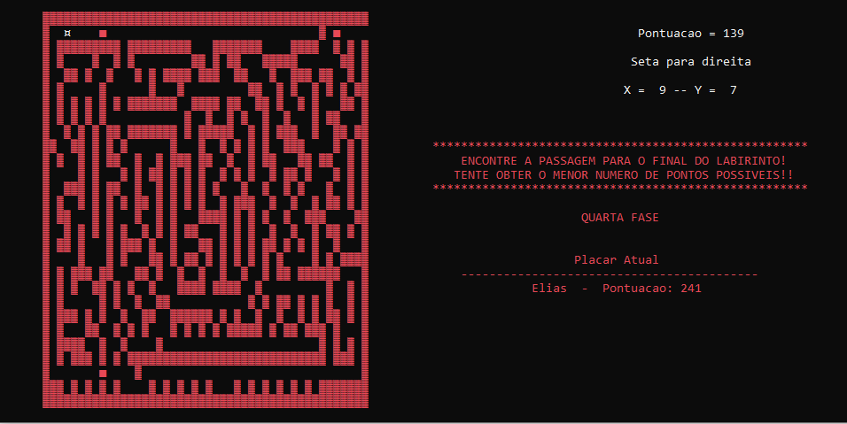
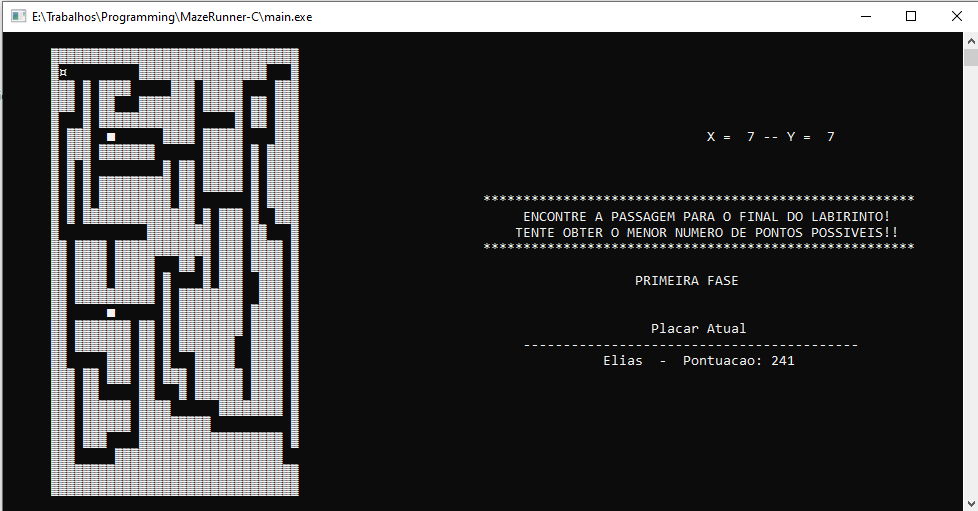

# MazeRunner-C

MazeRunner-C is a maze game programmed in C, where players must navigate through a complex labyrinth, avoiding obstacles and finding the exit.

## Features

- **Graphical Interface:** A clear visual representation of the maze, allowing players to see the layout and plan their moves.
- **Scoring System:** Players earn points based on how quickly they find the exit and the obstacles they avoid.
- **Different Levels:** Multiple levels of difficulty, challenging players as they progress.

## Details

- **Institution:** FEDERAL INSTITUTE OF EDUCATION, SCIENCE AND TECHNOLOGY OF SANTA CATARINA
- **Course:** Electrical Engineering Degree
- **Subject:** Programming II
- **Student:** Elias Anzini Junior
- **Semester:** 2021/1

## Requirements

- C Compiler (recommended: GCC)
- Graphical libraries (if applicable)

## Installation and Execution

1. Clone this repository.
2. Navigate to the project directory.
3. Compile the source code: `gcc main.c -o mazerunner`
4. Run the game: `./mazerunner`

## Contributions

Contributions are welcome! If you've found a bug or have a feature suggestion, please open an issue. If you wish to contribute to the code, feel free to fork and submit a pull request.

## License

This project is licensed under the MIT license.

## Contact

For questions, suggestions, or feedback, please contact: [eliasanzinijlle@outlook.com](mailto:eliasanzinijlle@outlook.com)

